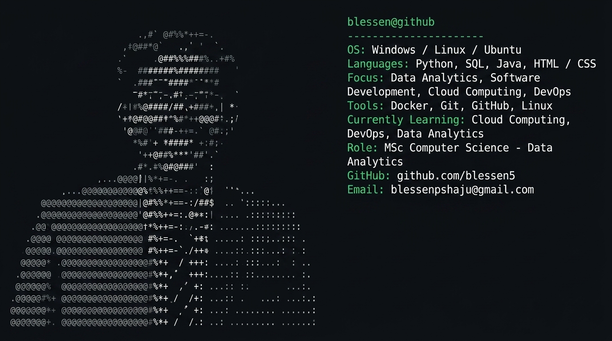

# Hi there, I'm Blessen P Shaju 

  <picture>
    <source media="(prefers-color-scheme: dark)" srcset="ascii_profile.svg">
    <source media="(prefers-color-scheme: light)" srcset="ascii_profile_light.svg">
    
  </picture>

---

##  About Me

I am a Master's student in **Computer Science (Data Analytics)** with a passion for building data-driven systems, analytics pipelines, and modern software solutions. My academic and project work centers on extracting insights from complex datasets, exploratory data analysis, and building software applications backed by solid engineering principles. 

I am continuously working to expand my knowledge in cloud infrastructure, containerization, and automated workflows to transition into a well-rounded technology professional.

---

##  My Skills

  

---

##  Certifications

*  **AI Essentials** — *Coursera*
*  **Generative AI Overview for Project Managers** — *PMI (Project Management Institute)*
*  **SQL and Relational Databases 101** — *Cognitive Class*
*  **Word Processing and Data Entry** — *KELTRON*

##  Connect With Me

  
  &nbsp;&nbsp;
  

*  **GitHub:** [https://github.com/blessen5](https://github.com/blessen5)
*  **Email:** [blessenpshaju@gmail.com](mailto:blessenpshaju@gmail.com)
